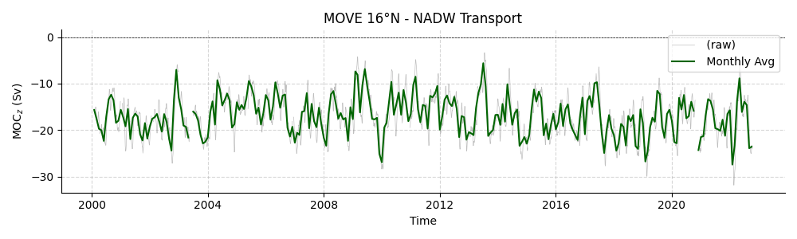
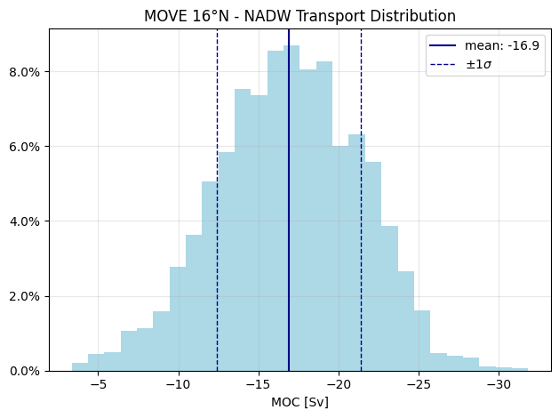
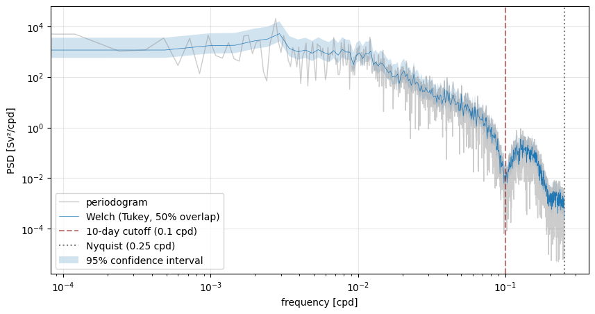

# Assignment 1

## Part A - Characterise the series (time domain)

The Meridional Overturning Variability Experiment (MOVE) is a moored array in the western Atlantic along 16°N, measuring North Atlantic Deep Water (NADW) at depths of 1200 to 5000 meters. NADW is the deep, southward flowing part of the AMOC, balancing warmer flows at the surface, such as the Gulf Stream.

The dataset contains 4164 observations at a sampling interval of 48 hours from 2000-02-06 until 2022-10-14, with a low-pass filter of 10 days. 180 out of those data points are missing values, which were interpolated linearly.

To remove sub-seasonal variability, a 3-month Tukey low-pass filter was applied, with the goal of focusing on seasonal and interannual variability. The raw and filtered timeseries can be seen here:

Since the entire timeseries shows negative transport values, the measurements confirm that NADW flows southward, with an average transport of -16.9 Sv and standard deviation of 4.5 Sv.
The transport varies between -3.3 and -31.9 Sv, covering a range of 28.5 Sv.

The distribution of MOC transport is shown here: 

The histogram appears roughly Gaussian, suggesting the variability is stochastic rather than driven by extreme outliers or skewed processes.

## Part B - The spectrum (frequency domain)

The following figure shows the Welch spectrum for the unfiltered and the filtered data, including a 95% confidence interval.
The Welch spectrum was computed using the Hann window with segment length 2048 and 50% overlap.

The 10-day cutoff persists, but due to the additional 3-month low-pass filter, only patterns with periods longer than 3 months (ca. $10^{-2}$ cpd) are preserved.
Since the observed variance is concentrated at low frequencies, the MOC transport is red noise.
The dominant timescale appears to be $10^{-2.7}$ cpd, which is equivalent to a period of around 500 days, representing interannual variability in NADW transport. 

However, somewhat unexpectedly, the spectrum does not show a peak for an annual cycle, which would be at $10^{-2.56}$ cpd.
Additionally, both spectra do not decrease as sharply as expected. This might be due to aliasing, poor window choice, or potentially a coding error.

The spectrum of the filtered data also exhibits similar patterns to the tapers characteristic for Tukey and Hann, rather than a simple linear decline for frequencies higher than the 3-month cut-off.

Additionally, the Parseval ratio of 0.89 is not that close to the expected value of 1, suggesting that there might be some mistake in the implementation of the Welch PSD or how it is used.